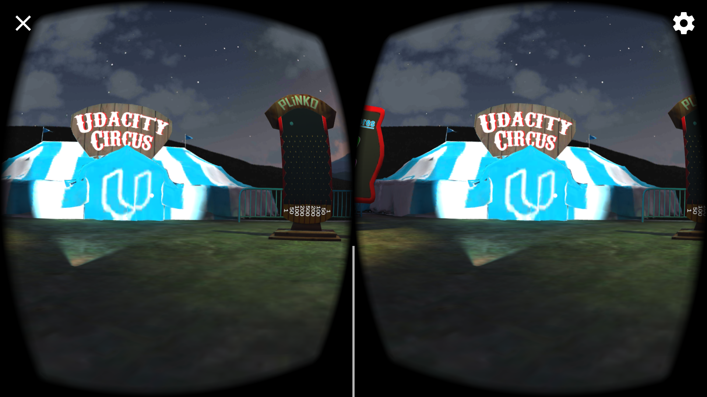
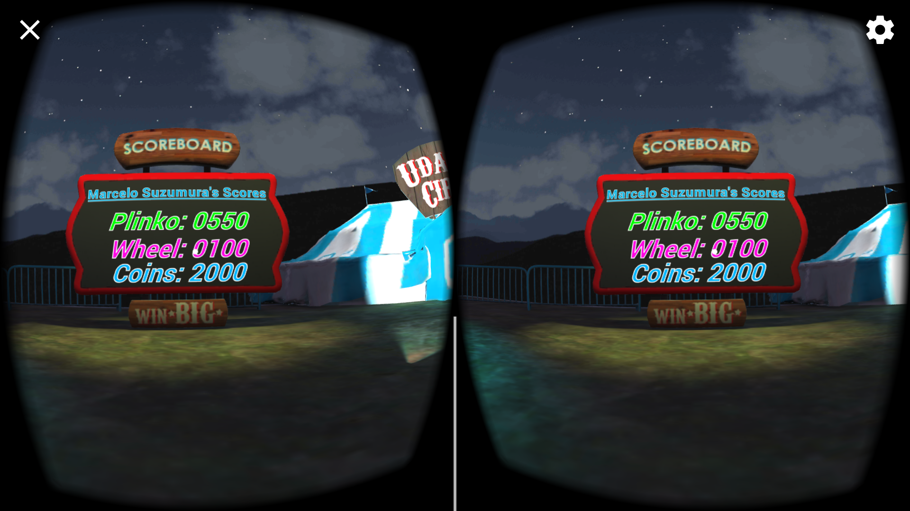
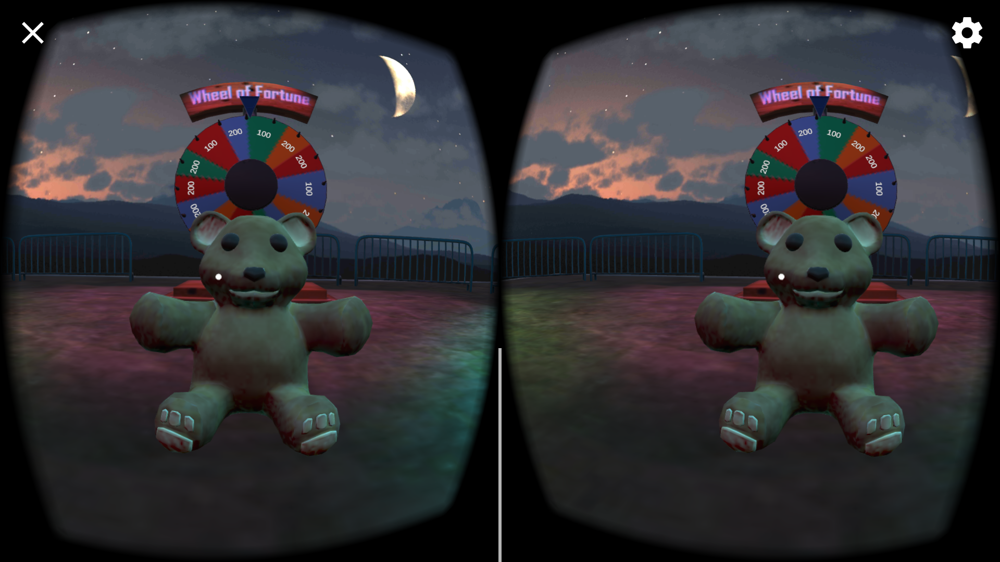

# Udacity VR Nanodegree

## Carnival

- Developed by **Marcelo Suzumura** based on provided starter project

### Summary

This project is part of [Udacity](https://www.udacity.com "Udacity - Be in demand")'s [VR Developer Nanodegree](https://www.udacity.com/course/vr-developer-nanodegree--nd017).

The purpose of this project is to get familiar with the Unity Editor and working with scenes.

It was built for Google Cardboard and tested on an Android device (Galaxy S7).

### Versions

- [Unity 2017.2.0f3](https://unity3d.com/get-unity/download/archive)
- [GVR Unity SDK v1.70.0](https://github.com/googlevr/gvr-unity-sdk/releases/tag/1.70.0)
